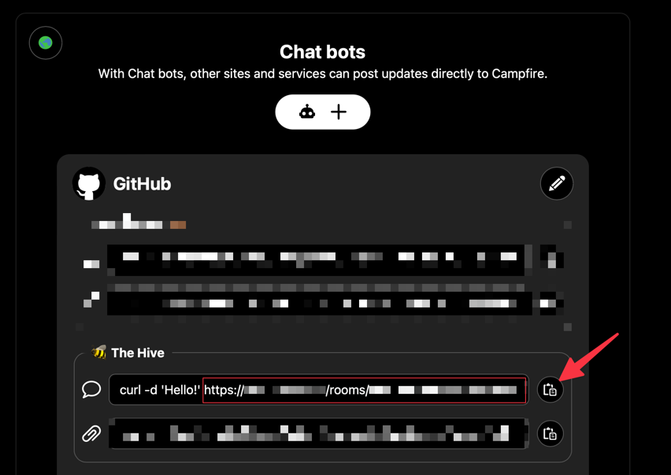

# Campfire notification GitHub Action

Get notified of GitHub events (commit pushed, job failed) through an action that posts messages into your ONCE Campfire chat.

### Post commit info on push
Use the `commit_pushed` template to get a helpful summary in chat when someone pushes a commit to main. It looks like this:


### Post notification when GitHub workflow job fails

If my workflow failed after pushing the commit from the previous screenshot,
here's how the notification message would look using the `job_failed` template:


## Usage

### Step 1: Create a bot

Creating a bot through Campfire, you'll end up on a screen like this:



Here I've named the bot "GitHub" and uploaded a matching icon as the profile picture.

Each room has a unique `curl` command that you can use to post messages to that room.

Locate the room you'd like to use with this action, and then copy the URL portion to use as a secret for the next step.

### Step 2: Create secret in your GitHub repo

You'll need to create a secret in your repo in order to securely pass the necessary details to the action,
so that it's able to post into the Campfire room.

Save the URL (the last part of the `curl` command, not the whole thing) into a new secret.
The URL acts as both an endpoint and a key, so no other details are needed.
For the following examples I've named the secret `CAMPFIRE_MESSAGES_URL`.

### Step 3: Add the action to your workflow

How you add the action to your workflow is based on the desired template/event type.

#### commit_pushed

If you're using the `commit_pushed` template, you'll want to trigger a workflow on `push` to your main branch.

It's convenient to have a dedicated workflow yaml file for this purpose. Here's an example:

`.github/workflows/post-commit-info.yml`:
```yaml
name: Post commit info

on:
   push:
      branches: [ main ]

jobs:
   post-commit-info:
      runs-on: ubuntu-latest

      steps:
         - name: Post commit info to Campfire
           uses: shane-lamb/campfire-notify-action@v1.1.4
           with:
              messages_url: ${{ secrets.CAMPFIRE_MESSAGES_URL }}
              template: commit_pushed
```

You can change the branch name if you're not using `main` as your development branch.

#### job_failed

For the `job_failed` template, instead of creating a new workflow, you'll want to add a step at the end of each job you'd like to monitor for failure.

Here's how you can add the action into the `steps` list of your existing job/s:

```yaml
steps:
   - name: Checkout
     uses: actions/checkout@v4

   - name: Do stuff that might fail
     uses: ...

   - name: Post job failure details to Campfire
     if: failure() && github.ref == 'refs/heads/main'
     uses: shane-lamb/campfire-notify-action@v1.1.4
     with:
        messages_url: ${{ secrets.CAMPFIRE_MESSAGES_URL }}
        template: job_failed
```

The `if` condition ensures that it'll only notify if the job has failed.

This example has an additional condition to only notify if the branch is `main`,
as you might not want the noise coming from feature branch builds.

## Development

This repo was initialised using the [typescript-action](https://github.com/actions/typescript-action) GitHub action template.

### Format, test, and build the action

   ```bash
   npm run all
   ```

### Publishing a New Release

This project includes a helper script, [`script/release`](./script/release)
designed to streamline the process of tagging and pushing new releases for
GitHub Actions.

GitHub Actions allows users to select a specific version of the action to use,
based on release tags. This script simplifies this process by performing the
following steps:

1. **Retrieving the latest release tag:** The script starts by fetching the most
   recent release tag by looking at the local data available in your repository.
1. **Prompting for a new release tag:** The user is then prompted to enter a new
   release tag. To assist with this, the script displays the latest release tag
   and provides a regular expression to validate the format of the new tag.
1. **Tagging the new release:** Once a valid new tag is entered, the script tags
   the new release.
1. **Pushing the new tag to the remote:** Finally, the script pushes the new tag
   to the remote repository. From here, you will need to create a new release in
   GitHub and users can easily reference the new tag in their workflows.
